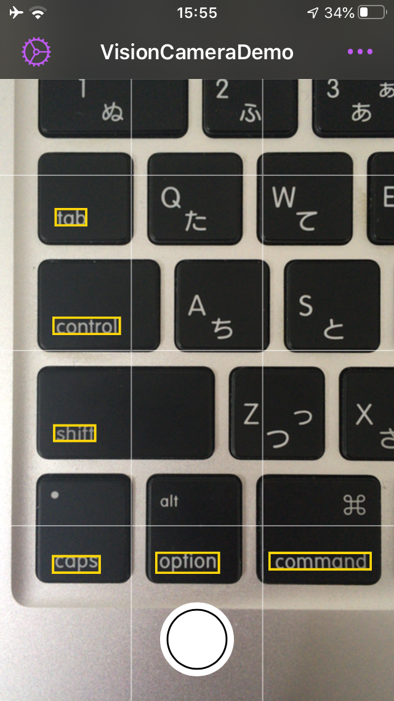
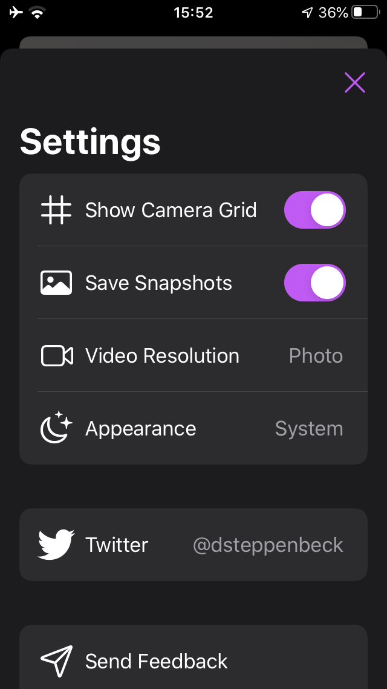

# VisionCameraDemo

**VisionCameraDemo** is a demo project for building a simple iOS camera that performs OCR and highlights text in the image in real time.

Created as a starting point for [WRD Scanner Pro](https://apps.apple.com/app/id1449966107) Version 2.0, I'm rewriting the code base from the ground up using the latest Apple frameworks including *Vision* and *Combine*.

- [Preview](#preview)
- [Requirements](#requirements)
- [Contributing](#contributing)
- [License](#license)

## Preview

    
    

## Requirements

- Swift 5.1+
- iOS 13.0+

## Contributing

- If you've **found a bug**, please open an [issue](https://github.com/davidsteppenbeck/VisionCameraDemo/issues).
- If you **have a feature request**, open an [issue](https://github.com/davidsteppenbeck/VisionCameraDemo/issues).

## License

**VisionCameraDemo** is available under the MIT license. See the [LICENSE](https://github.com/davidsteppenbeck/VisionCameraDemo/blob/master/LICENSE) file for more info.
